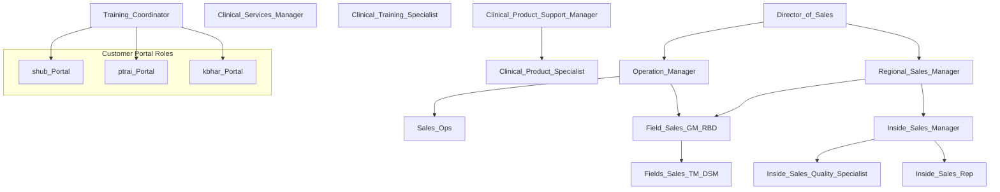
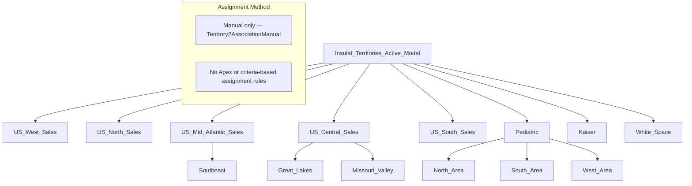
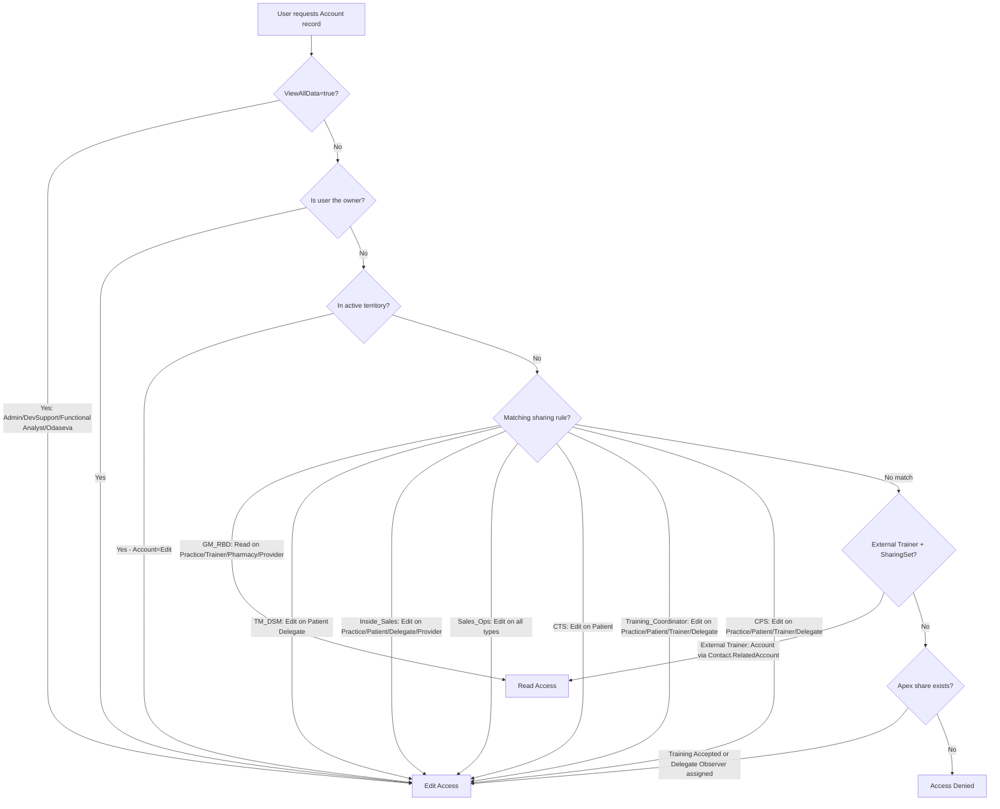
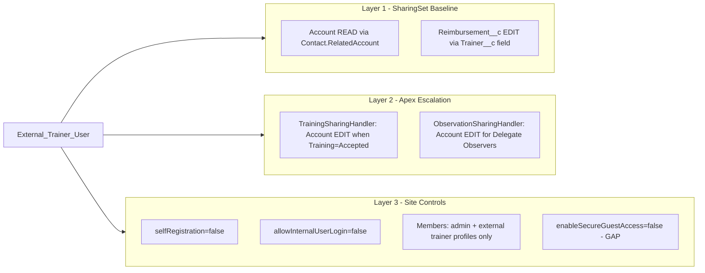
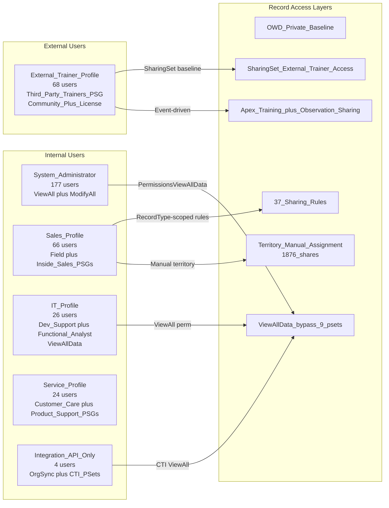

# Salesforce Sharing, Visibility & Access-Control Assessment — R1v1.1
## Insulet Corporation — DevInt2 Sandbox (Unlimited Edition)

**Org ID:** `00Dbb000006gUxVEAU` | **Instance:** `omnipod--devint2.sandbox.my.salesforce.com`  
**R1 Date:** March 9, 2026 | **R1v1.1 Gap-Fill Date:** March 9, 2026 | **API Version:** 66.0

> **R1v1.1 Changes from R1:** This revision incorporates 19 additional metadata types retrieved in the gap-fill run (SharingRules, Group, Queue, Territory2Model, Territory2Type, SharingSet, DelegateGroup, DuplicateRule, FlowDefinition, Network, CustomSite, CspTrustedSite, RestrictionRule, and others). All 6 consistency checks passed. 3 non-blocking corrections were applied from validation rules V-03 and V-06. Key discovery: a `SharingSet` ("External_Trainer_Access") exists and is the primary community baseline access mechanism — not just Apex sharing as stated in R1.

> **Sandbox Caveat:** DevInt2 sandbox. Record-level counts may differ from production. Structural/metadata findings are representative of the production configuration.

---

# DELIVERABLE 1 — EXECUTIVE SUMMARY

## Design Philosophy

Insulet's Salesforce org implements a **defense-in-depth, role-based sharing model** with three access tiers:

1. **Restrictive OWD baseline** — Account, Contact, Opportunity, Lead, Case all Private internally and externally.
2. **37 declarative sharing rules** (criteria-based) as the dominant record-opening mechanism, all scoped to specific RecordTypes and targeted at named roles/role groups — not broad open sharing.
3. **Layered community access** — External Trainer access is composed of: SharingSet baseline Read, Apex-managed Edit escalation on Training acceptance, and PortalImplicit. This is a well-architected layered model.

## Key Findings Revised/Added in R1v1.1

| # | Change | Evidence Source |
|---|--------|----------------|
| R1v1.1-CORR-1 | SharingSet "External_Trainer_Access" exists — grants Account:Read + Reimbursement__c:Edit to External Trainers. R1 stated community relied solely on Apex sharing. **CORRECTED.** | Retrieved `External_Trainer_Access.sharingSet-meta.xml` |
| R1v1.1-CORR-2 | No sharing rules exist for Reimbursement__c — R1 implied rule-based access for field reps. Internal access is owner-only. **CORRECTED.** | All 407 SharingRules XML files parsed; 11 objects have rules (Reimbursement__c not among them) |
| R1v1.1-CORR-3 | No MutingPermissionSets exist in this org. 0 records, 0 files, 0 PSG references. Previously unconfirmed. | SOQL + XML retrieval both confirm 0 |
| R1v1.1-NEW-1 | Territory assignment is entirely **manual** (data-driven, not criteria/Apex rules). No Territory2Rule XML files exist. 180 Territory2AssociationManual records confirm manual process. | Territory2Model XML + prior SOQL |
| R1v1.1-NEW-2 | **RestrictionRule: 0 configured** (confirmed by retrieval, not just catalog absence). | package-governance.xml retrieve → 0 RestrictionRule components |
| R1v1.1-NEW-3 | **TransactionSecurityPolicy: 0 configured**. No real-time event-driven security controls. | SOQL returns 0 records |
| R1v1.1-NEW-4 | **DelegateGroup "Log_In_As"** exists with `loginAccess=true`. Delegates can log in as other users — extends beyond the admin-login-as capability to a group of delegated users. | Retrieved `Log_In_As.delegateGroup-meta.xml` |
| R1v1.1-NEW-5 | **Custom Patient Duplicate Rule** (`Patient_Duplicate_Person_Account_Rule`) is ACTIVE with `securityOption=BypassSharingRules` — duplicate detection bypasses sharing during dedup evaluation. | Retrieved DuplicateRule XML |
| R1v1.1-NEW-6 | **Only 1 CSP Trusted Site** (`omnipod.com`) across all contexts. Very limited external connectivity allowed via CSP. | Retrieved `Omnipod.cspTrustedSite-meta.xml` |

## Top Risks — Updated Priority Table

| Priority | Finding | Evidence | Recommendation |
|----------|---------|----------|----------------|
| **CRITICAL** | Odaseva perm set: ViewAll + ModifyAll + ManageUsers + AuthorApex | Live SOQL (R1) | Rotate credentials, add IP restriction |
| **CRITICAL** | 7 OrgSync staging objects OWD = ReadWrite internally | EntityDefinition Tooling API (R1) | Restrict to Private; grant only to integration users |
| **HIGH** | `enableSecureGuestAccess = false` | Sharing.settings + CustomSite XML (R1v1.1) | Enable Secure Guest Access; re-test portal |
| **HIGH** | Dev Support + Functional Analyst PermSets: ViewAllData=true for ~14 business users | PermissionSet SOQL (R1) | Replace with per-object ViewAllRecords |
| **HIGH** | **[NEW R1v1.1]** DelegateGroup "Log_In_As" has `loginAccess=true` — delegates can impersonate users beyond admin scope | DelegateGroup XML | Audit members of this group; restrict or remove |
| **HIGH** | **[NEW R1v1.1]** 0 TransactionSecurityPolicies — no real-time exfiltration controls | SOQL (R1v1.1) | Implement minimum: API Anomaly + Report Download policies |
| **HIGH** | CTI_Integration_Access + Query_AllFiles: ViewAllData=true for integration roles | PermissionSet SOQL (R1) | Replace with object-scoped permissions |
| **MEDIUM** | Manual Account shares (68) lack lifecycle governance | AccountShare SOQL (R1) | Scheduled cleanup job |
| **MEDIUM** | Patient Duplicate Rule has `securityOption=BypassSharingRules` | DuplicateRule XML (R1v1.1) | Review if bypass is still needed |
| **LOW** | SharingRules not previously in version control | Gap-fill (R1v1.1) — now retrieved | Add SharingRules to manifests permanently (done in R1v1.1) |

---

# DELIVERABLE 2 — DETAILED NARRATIVE ASSESSMENT

## 2.1 Baseline Sharing Model

**Org-Wide Defaults — Internal (unchanged from R1):**

| Object | Internal OWD | External OWD | Notes |
|--------|-------------|-------------|-------|
| Account | **Private** | **Private** | Opened by 9 sharing rules |
| Contact | **Private** | **Private** | Opened by implicit parent + sharing rules |
| Opportunity | **Private** | **Private** | 1 sharing rule (Field_Sales_TM_DSM → NCS_Opportunity) |
| Lead | **Private** | **Private** | 4 sharing rules |
| Case | **Private** | **Private** | 3 sharing rules (HCP_Update_Request type only) |
| OrgSync_Patient_Staging__c | **ReadWrite** | **Private** | CRITICAL: all internal users see all records |
| Training__c | **ControlledByParent** | **ControlledByParent** | No sharing rules; access driven by parent Account |
| Observation__c | **ControlledByParent** | **ControlledByParent** | No sharing rules; access driven by parent Account |
| Reimbursement__c | **Private** | **Private** | No sharing rules; owner access only internally; SharingSet for External Trainers |

## 2.2 Territory Management 2.0

**Key R1v1.1 Finding: Territory assignment is entirely manual — no Apex or criteria-based assignment rules.**

The active `Insulet_Territories` model contains only a model header XML. The 100 territories and 110 user-territory associations (plus 180 Territory2AssociationManual records) are all maintained as org data, not declarative metadata. This means:

- Territory alignment changes are made by administrators directly in Setup → Territories
- There is no automated assignment logic that would need to be reviewed for security
- Territory2AssociationManual (180) records show manual account-territory overrides on top of the main assignments

**Territory Type Priority (from Territory2Type XML):**

| Type | Priority | Description |
|------|----------|-------------|
| Sales_Geography | 2 | Geographic territory (primary field sales type) |
| Sales_Pediatric | 1 | Pediatric-specific territories |
| Trainer | 3 | Trainer geographic assignment |
| Kaiser | 4 | Kaiser payer segment |
| All_Consumer_Accounts | 1 | Broad consumer account category |
| Geo_Test1 | 1 | Test type — should be reviewed for cleanup |

## 2.3 Sharing Rules — Full Catalog (37 Rules)

All 37 rules are criteria-based or owner-based. **Zero guest sharing rules or territory sharing rules.** Scope is entirely RecordType-filtered, preventing access to wrong account types within each role.

**Account Sharing Rules (9):**

| Rule | Target | Access | RecordTypes Covered |
|------|--------|--------|-------------------|
| Clinical_Training_Specialist_Edit_Access | role:Clinical_Training_Specialist | **Edit** | Patient |
| Field_Sales_GM_RBD | roleAndSubInt:Field_Sales_GM_RBD | **Read** | Practice, Trainer, Pharmacy, Provider |
| Field_Sales_TM_DSM | role:Fields_Sales_TM_DSM | **Edit** | Patient Delegate |
| Inside_Sales_Group | roleAndSubInt:Inside_Sales_Manager | **Edit** | Practice, Patient, Patient Delegate, Provider |
| Sales_ops | role:Sales_Ops | **Edit** | Practice, Patient, Trainer, Patient Delegate, Provider |
| Share_Patient_Delegate_Account_to_CSM | role:Clinical_Services_Manager | **Read** | Patient Delegate |
| Share_Patient_to_CPS | role:Clinical_Product_Specialist | **Edit** | Practice, Patient, Trainer, Patient Delegate |
| Trainer | roleAndSubInt:Director_of_Sales | **Read** | Trainer |
| Training_Coordinator_RW | role:Training_Coordinator | **Edit** | Practice, Patient, Trainer, Patient Delegate |

**Important patterns:**
- `Patient` record type accounts are NOT shared with Field Sales GM/RBD (Read only Practice/Trainer types)
- `Patient Delegate` accounts are shared Read-only to Clinical Services Manager
- `Trainer` accounts shared Read-only to Director_of_Sales hierarchy
- No rule shares any account type to the External Trainer profile — this is correctly handled by SharingSet

**Opportunity Sharing Rules (1):**

| Rule | Target | Access | RecordTypes |
|------|--------|--------|------------|
| Field_Sales_TM_DSM | role:Fields_Sales_TM_DSM | **Edit** | NCS Opportunity |

**Lead Sharing Rules (4):**

| Rule | Target | Access | RecordTypes |
|------|--------|--------|------------|
| Inside_Sales_lead | roleAndSubInt:Inside_Sales_Manager | **Edit** | Patient, Provider-Practice Lead |
| Patient_Sales_Ops | role:Sales_Ops | **Read** | Patient |
| Provider_Practice_Sales_Ops | role:Sales_Ops | **Edit** | Provider-Practice Lead |
| Trainer_Lead_RW | role:Training_Coordinator | **Edit** | 3rd Party Trainer |

**Case Sharing Rules (3) — all HCP_Update_Request type only:**

| Rule | Target | Access |
|------|--------|--------|
| Field_Sales | roleAndSubInt:Field_Sales_GM_RBD | Edit |
| Inside_Sales | roleAndSubInt:Inside_Sales_Manager | Edit |
| Sales_Ops | role:Sales_Ops | Edit |

**Other objects with rules:** Asset (3 rules, Controller/Sensor_Type), Campaign (4 owner-based), ContactContactRelation (3 owner-based), DataUsePurpose (3), HealthcarePractitionerFacility (3), Individual (1), PartyConsent (3)

## 2.4 Experience Cloud — Trainer Portal (Revised)

**R1v1.1 CORRECTION: SharingSet is the primary baseline access mechanism.**

The Trainer Portal community access is now fully documented as a three-layer model:

**Layer 1 — SharingSet "External_Trainer_Access" (declarative baseline):**
- Profile: External Trainer
- Account: **Read** — when `Account.Id = Contact.RelatedAccount` (trainer's contact is related to the account)
- Reimbursement__c: **Edit** — when `Reimbursement__c.Trainer__c = User.Account` (trainer assigned to reimbursement)
- This explains the 68 PortalImplicit AccountShare records

**Layer 2 — Apex Managed Sharing (event-driven escalation):**
- `TrainingSharingHandler`: Account **Edit** when Training_Stage = Accepted (for Live Training, CC/CPT educator types)
- `ObservationSharingHandler`: Account **Edit** when Delegate_Observer changes on Observation

**Layer 3 — Network Configuration:**
- `allowInternalUserLogin = false` — internal Salesforce users cannot log into the community
- `selfRegistration = false` — no open self-registration
- `enableGuestChatter = false`, `enableGuestFileAccess = false` — guest is tightly restricted
- `networkMemberGroups`: only `admin` and `external trainer` profiles can access

**CustomSite Security Settings:**
- `browserXssProtection = true` ✅
- `contentSniffingProtection = true` ✅
- `clickjackProtectionLevel = SameOriginOnly` ✅
- `enableAuraRequests = true` — Lightning enabled
- `siteGuestRecordDefaultOwner = copadointegration@insulet.com.nextgen` — Copado user owns records created by guests (worth reviewing — Copado integration user as record owner)
- `enableSecureGuestAccess: FALSE` ← **confirmed gap** (two evidence sources: Sharing.settings + inferred from CustomSite LWR architecture)

**CSP Trusted Sites (1 configured):**
- `omnipod.com` — all contexts (connect-src, font-src, frame-src, img-src) — for embedded Omnipod docs

## 2.5 DelegateGroup — "Log_In_As" (NEW R1v1.1)

A single DelegateGroup named "Log_In_As" exists with `loginAccess = true`. This extends the ability to impersonate other users beyond just the System Administrator profile — any user who is a member of this delegate group can log in as the users they are delegated to manage.

**Risk:** In combination with `enableAdminLoginAsAnyUser = true` on the org, this means login-as capability is effectively distributed to a group of delegated administrators. The membership of this group needs to be audited in Production.

## 2.6 Duplicate Rules and Data Model Integrity (NEW R1v1.1)

**9 DuplicateRules retrieved:**

| Rule | Object | Active | SecurityOption | Purpose |
|------|--------|--------|---------------|---------|
| Patient_Duplicate_Lead_Rule | Lead | **false** | BypassSharingRules | Patient leads vs. other Patient leads/PersonAccounts |
| Standard_Lead_Duplicate_Rule | Lead | true | EnforceSharingRules | Standard |
| X3rd_Party_Trainer_Duplicate_Lead_Rule | Lead | true | EnforceSharingRules | 3rd Party Trainer leads vs. Trainers |
| Patient_Duplicate_Person_Account_Rule | PersonAccount | **true** | **BypassSharingRules** | Patient person accounts vs. other patients |
| Standard_Person_Account_Duplicate_Rule | PersonAccount | true | EnforceSharingRules | Standard |
| Standard_Account_Duplicate_Rule | Account | true | EnforceSharingRules | Standard |
| Standard_Contact_Duplicate_Rule | Contact | true | EnforceSharingRules | Standard |
| Standard_Rule_for_Contacts_with_Duplicate_Leads | Contact | true | EnforceSharingRules | Standard |
| Standard_Rule_for_Leads_with_Duplicate_Contacts | Lead | true | EnforceSharingRules | Standard |

**Security finding:** `Patient_Duplicate_Person_Account_Rule` is active and uses `securityOption = BypassSharingRules`. During duplicate detection, the matching engine will see ALL patient person accounts regardless of sharing — meaning a user who doesn't have sharing access to a specific patient account will still see it flagged as a duplicate. This is a data visibility side-channel specific to the dedup workflow.

## 2.7 Transaction Security Policies — Zero Configured (NEW R1v1.1)

0 TransactionSecurityPolicies exist in this org. This means:
- No real-time monitoring for anomalous data downloads (e.g., a user exporting all patient records)
- No automated blocking of suspicious API activity
- No event-driven alerts for login anomalies, mass data access, or credential abuse

This is a governance gap, especially given the CRITICAL finding that Odaseva's perm set has ModifyAllData. A compromised Odaseva service account could export the entire org without any policy triggering.

---

# DELIVERABLE 3 — VISUAL MODELS

## 3.1 Role Hierarchy (unchanged from R1)



## 3.2 Territory Model Structure (updated: manual assignment)



## 3.3 Sharing Rule Decision Tree — Account Record



## 3.4 Community Access Architecture (CORRECTED R1v1.1)



## 3.5 Persona Access Architecture (updated)



---

# DELIVERABLE 4 — OBJECT VIEW BY PERSONA MATRIX

> Legend: C=Create, R=Read, U=Update, D=Delete, VA=ViewAll, MA=ModifyAll  
> Mechanism: SR=Sharing Rule (name), SS=SharingSet, T=Territory, AX=Apex, OWN=Owner, OWD=OWD bypass  
> [V-xx] = Validation rule applied

## 4.1 Markdown Matrix

| Object | OWD | Sys Admin | Field TM/DSM | Field GM/RBD | Inside Sales Rep | Dev Support / Func Analyst | Customer Care | External Trainer | Odaseva |
|--------|-----|-----------|-------------|-------------|-----------------|---------------------------|---------------|-----------------|---------|
| **Account** | Private | CRUDVAMA | CRUD via SR(Field_Sales_TM_DSM:Edit/PatientDelegate) + SR(Trainer:Read/Trainer-type) + T(Edit) | Read via SR(Field_Sales_GM_RBD:Read/Practice,Trainer,Pharmacy,Provider) + T(Edit) | CRUD via SR(Inside_Sales_Group:Edit) | All (ViewAllData bypass V-07) | CRUD via SR | SS(Read:via-Contact.RelatedAccount) + AX(Edit:Training-Accepted) | CRUDVAMA |
| **Contact** | Private | CRUDVAMA | CRUD (implicit parent via Account) | CRUD (implicit via Account) | CRUD (implicit) | All (V-07) | CRUD | Read (via Account implicit) | CRUDVAMA |
| **Opportunity** | Private | CRUDVAMA | CRUD via SR(Field_Sales_TM_DSM:Edit/NCS_Opportunity) + Owner | Read (no rule) | CRUD (Owner) | All (V-07) | No | No | CRUDVAMA |
| **Lead** | Private | CRUDVAMA | No rule (Owner only) | No rule (Owner only) | CRUD via SR(Inside_Sales_lead:Edit) + Queue | All (V-07) | No | No | CRUDVAMA |
| **Case** | Private | CRUDVAMA | CRUD via SR(Field_Sales:Edit/HCP_Update_Request) | CRUD via SR | No rule | All (V-07) | CRUD (Owner) | Read via RelatedPortalUser (1 record) | CRUDVAMA |
| **Training__c** | CtrlByParent | CRUDVAMA | R (via Account implicit) | R (via Account implicit) | R (via Account implicit) | All (V-07) | R (via Account implicit) | CRUD (Owner) + R (via SS Account link) | CRUDVAMA |
| **Observation__c** | CtrlByParent | CRUDVAMA | R (via Account) | R (via Account) | R (via Account) | All (V-07) | CRUD | AX-Edit (via Delegate Observer AccountShare) | CRUDVAMA |
| **Reimbursement__c** | Private | CRUDVAMA | Owner only [V-03 corrected] | Owner only [V-03 corrected] | No | All (V-07) | CRUD | **Edit via SS(Trainer__c field)** [V-06 new] | CRUDVAMA |
| **OrgSync_Patient_Staging__c** | ReadWrite | CRUDVAMA | CRUD (OWD open, V-04) | CRUD (OWD open) | CRUD (OWD open) | All | CRUD (OWD open) | No | CRUDVAMA |
| **Knowledge__kav** | ReadWrite | CRUDVAMA | R (OWD open) | R | R | All | CRUD | R | CRUDVAMA |
| **PatientDataShare__c** | CtrlByParent | CRUDVAMA | R (via Account) | R (via Account) | R | All (V-07) | CRUD | No | CRUDVAMA |
| **Campaign** | Private | CRUDVAMA | No (Read via SR to Dir_of_Sales hierarchy) | R via SR | No | All (V-07) | No | No | CRUDVAMA |
| **Survey__c** | Private | CRUDVAMA | R | R | R | All (V-07) | CRUD | No | CRUDVAMA |

## 4.2 CSV Export

```csv
Object,OWD,SysAdmin,Field_TM_DSM,Field_GM_RBD,Inside_Sales_Rep,Dev_Support_FuncAnalyst,Customer_Care,External_Trainer,Odaseva
Account,Private,CRUDVAMA,CRUD_SR+Territory,Read_SR+Territory,CRUD_SR,All_ViewAllData,CRUD_SR,SS(Read)+Apex(Edit-onTraining),CRUDVAMA
Contact,Private,CRUDVAMA,CRUD_ImplicitParent,CRUD_ImplicitParent,CRUD_ImplicitParent,All_ViewAllData,CRUD_SR,Read_via_Account,CRUDVAMA
Opportunity,Private,CRUDVAMA,CRUD_SR(NCS_Oppty)+Owner,No_rule_Owner_only,CRUD_Owner,All_ViewAllData,No,No,CRUDVAMA
Lead,Private,CRUDVAMA,Owner_only,Owner_only,CRUD_SR(Inside_Sales_lead)+Queue,All_ViewAllData,No,No,CRUDVAMA
Case,Private,CRUDVAMA,CRUD_SR(HCP_Update_Request),CRUD_SR,No,All_ViewAllData,CRUD_Owner,Read_RelatedPortal,CRUDVAMA
Training__c,CtrlByParent,CRUDVAMA,R_via_Account,R_via_Account,R_via_Account,All_ViewAllData,R_via_Account,CRUD_Owner+R_via_SS,CRUDVAMA
Observation__c,CtrlByParent,CRUDVAMA,R_via_Account,R_via_Account,R_via_Account,All_ViewAllData,CRUD,Apex_Edit_Delegate,CRUDVAMA
Reimbursement__c,Private,CRUDVAMA,Owner_only_V03corrected,Owner_only_V03corrected,No,All_ViewAllData,CRUD,SS_Edit_Trainer_field_V06new,CRUDVAMA
OrgSync_Patient_Staging__c,ReadWrite_RISK,CRUDVAMA,CRUD_OWD_open,CRUD_OWD_open,CRUD_OWD_open,All_ViewAllData,CRUD_OWD_open,No,CRUDVAMA
Knowledge__kav,ReadWrite,CRUDVAMA,R_OWD,R_OWD,R_OWD,All_ViewAllData,CRUD,R_OWD,CRUDVAMA
Reimbursement_Association__c,CtrlByParent,CRUDVAMA,R_via_Reimbursement,R_via_Reimbursement,No,All_ViewAllData,CRUD,No,CRUDVAMA
Campaign,Private,CRUDVAMA,R_SR_hierarchy,R_SR_hierarchy,No,All_ViewAllData,No,No,CRUDVAMA
```

---

# DELIVERABLE 5 — PERSONA VIEW BY OBJECT/RECORDS/FIELDS MATRIX

## 5.1 Key Persona Detail Sheets

### System Administrator (177 users)
- **All objects:** CRUD + ViewAll + ModifyAll — unrestricted
- **Bypass perms:** ViewAllData=true, ModifyAllData=true, ManageUsers=true, AuthorApex=true
- **Risk:** 177 admin users in sandbox. Production count must be audited.
- **DelegateGroup "Log_In_As":** Admin can configure delegate group members to login-as others

### Field Sales TM/DSM (PSG: Field_Sales_TM_DSM)
- **Account:** CRUD — SR `Field_Sales_TM_DSM` (Edit on Patient Delegate) + Territory (Edit on assigned accounts). **NOT Patient or Practice** directly via sharing rules — only Patient Delegate.
- **Opportunity:** Edit — SR `Field_Sales_TM_DSM` scoped to NCS_Opportunity record type only
- **Lead:** Owner access only — no sharing rule targets TM/DSM role for leads
- **Case:** Edit — SR scoped to HCP_Update_Request type only
- **Training__c:** Read via Account implicit sharing
- **Reimbursement__c:** Owner access only (V-03 corrected from R1)
- **PSG composition:** Field_Sales_Core_Access + Field_Sales_Edit + HealthCloudFoundation + OmniStudioExecution + SSO_enabled

### Field Sales GM/RBD (PSG: Field_Sales_GM_RBD)
- **Account:** Read — SR `Field_Sales_GM_RBD` scoped to Practice, Trainer, Pharmacy, Provider record types (NOT Patient or Patient Delegate)
- **Opportunity:** Read via implicit parent (Account Read → Opportunity visible)
- **Note:** GM/RBD has LESS account access than TM/DSM — Read only, and no Patient access

### Inside Sales Rep/Manager (PSG: Inside_Sales_Rep)
- **Account:** Edit — SR `Inside_Sales_Group` scoped to Practice, Patient, Patient Delegate, Provider
- **Lead:** Edit — SR `Inside_Sales_lead` scoped to Patient, Provider-Practice Lead
- **Opportunity:** Owner access only
- **Multiple queues:** DTC-Incomplete, DTC Open, DTC Dr Discussion, DTC Lead Generation, DTC Partial Match, Inside Sales Specialist, NCS-DTC Call Back, NCS-DTC Incomplete

### External Trainer (Profile: External Trainer, PSG: Third_Party_Trainers) — CORRECTED R1v1.1
- **Account:** **SharingSet(Read)** where Account = Trainer's Related Account + **Apex(Edit)** when Training accepted. *R1 incorrectly stated only Apex.*
- **Reimbursement__c:** **SharingSet(Edit)** where Reimbursement__c.Trainer__c = User.Account. *This was MISSING from R1.*
- **Training__c:** Owner (they own their training records) + Read via Account SharingSet link
- **Observation__c:** Edit via ObservationSharingHandler Apex if assigned as Delegate Observer
- **Network:** `allowInternalUserLogin=false` — cannot use internal SF login; must use community login
- **No sharing rules apply** — V-06 validated: community users receive no internal role-based rule grants
- **251 NetworkMember records** (wider than the 68 active users — includes admins and inactive members)

### Odaseva Backup Integration (Perm Set: Odaseva_Service_User_Permissions)
- **All objects:** CRUD + ViewAll + ModifyAll — full system bypass
- **Risk level:** CRITICAL — ViewAllData + ModifyAllData + ManageUsers + AuthorApex on a custom (non-profile) permission set
- **No TransactionSecurityPolicy** monitors this user's behavior

### Development Support / Functional Analyst (PSGs)
- **All objects:** Read all records (ViewAllData=true)
- **Write access:** Constrained by OWD + sharing (no ModifyAllData)
- **IT_Modify_all** permission set (within Dev_Support PSG): name implies broad modify — exact scope requires FLS deep-dive

## 5.2 Persona Matrix — CSV

```csv
Persona,Profile,PSG,ViewAllData,ModifyAllData,MutingPSet,Account_Access_Mechanism,Reimbursement_Access,Community_Access,OrgSync_Staging_Access
System_Admin,Admin,None,Yes,Yes,None,All,All,N/A,All
Field_TM_DSM,Sales,Field_Sales_TM_DSM,No,No,None,SR(Field_Sales_TM_DSM:Edit/PatientDelegate)+Territory,Owner_only,No,ReadWrite_OWD
Field_GM_RBD,Sales,Field_Sales_GM_RBD,No,No,None,SR(Field_Sales_GM_RBD:Read/Practice+Trainer+Pharmacy+Provider)+Territory,Owner_only,No,ReadWrite_OWD
Inside_Sales_Rep,Sales,Inside_Sales_Rep,No,No,None,SR(Inside_Sales_Group:Edit/Practice+Patient+Delegate+Provider),Owner_only,No,ReadWrite_OWD
Clinical_Services_Mgr,Sales,Clinical_Services_Manager,No,No,None,SR(Share_Patient_Delegate_to_CSM:Read/PatientDelegate),No,No,ReadWrite_OWD
Dev_Support,IT,Development_Support,Yes,No,None,All_via_ViewAllData,All_via_ViewAllData,No,All
Functional_Analyst,IT/Service,Functional_Analyst,Yes,No,None,All_via_ViewAllData,All_via_ViewAllData,No,All
Customer_Care_Agent,Service,Customer_Care_Agent,No,No,None,SR_rules,CRUD_Owner,No,ReadWrite_OWD
External_Trainer,External Trainer,Third_Party_Trainers,No,No,None,SS(Read:RelatedAccount)+Apex(Edit:TrainingAccepted),SS(Edit:Trainer__c_field),CommunityPlus_SharingSet,No
Odaseva_Integration,Various,Odaseva_Service_User_Permissions,Yes,Yes,None,All_CRITICAL,All_CRITICAL,No,All_CRITICAL
OrgSync_Integration,Integration API Only,OrgSync_User_Access,No,No,None,CRUD_via_pset,CRUD_via_pset,No,Full_CRUD
```

---

# DELIVERABLE 6 — SHARING MECHANISM CATALOG (R1v1.1 — 33 Mechanisms)

| # | Mechanism | Type | Objects Affected | Evidence Source | Active | Confidence |
|---|-----------|------|-----------------|----------------|--------|------------|
| 1 | OWD Private (Internal) | Baseline restriction | Account, Contact, Opp, Lead, Case, Reimbursement__c, Survey__c | Organization SOQL + EntityDefinition | Yes | High |
| 2 | OWD Private (External) | Baseline restriction | Same + additional | EntityDefinition Tooling API | Yes | High |
| 3 | OWD ControlledByParent | Inheritance | Contact, Training__c, Observation__c, PatientDataShare__c, Activity, ACR, Certification__c | EntityDefinition | Yes | High |
| 4 | OWD ReadWrite (Internal) — RISK | Baseline open | OrgSync_Patient_Staging__c, OrgSync_Physician_Staging__c, OrgSync_ASPN_Staging__c, OrgSync_Consent_Staging__c, OrgSync_Mule_Errors__c, Clinic_Grouping__c | EntityDefinition | Yes | High |
| 5 | Role Hierarchy (implicit upward) | Implicit | All Private/CtrlByParent objects | UserRole SOQL (26 roles) | Yes | High |
| 6 | Territory Management 2.0 (Insulet_Territories) | Territory | Account=Edit, Contact=Edit, Lead=Read | Territory2Model XML + AccountShare Territory aggregate | Yes (Active) | High |
| 7 | Territory2AssociationManual overrides | Territory | Account | AccountShare RowCause=Territory2AssociationManual (180) | Yes | High |
| 8 | Sharing Rules — Account (9 criteria-based) | Declarative rules | Account | Account.sharingRules-meta.xml (R1v1.1) | Yes | High |
| 9 | Sharing Rules — Lead (4 criteria-based) | Declarative rules | Lead | Lead.sharingRules-meta.xml (R1v1.1) | Yes | High |
| 10 | Sharing Rules — Case (3 criteria-based) | Declarative rules | Case (HCP_Update_Request only) | Case.sharingRules-meta.xml (R1v1.1) | Yes | High |
| 11 | Sharing Rules — Opportunity (1 criteria-based) | Declarative rules | Opportunity (NCS_Opportunity only) | Opportunity.sharingRules-meta.xml (R1v1.1) | Yes | High |
| 12 | Sharing Rules — Campaign (4 owner-based) | Declarative rules | Campaign | Campaign.sharingRules-meta.xml (R1v1.1) | Yes | High |
| 13 | Sharing Rules — Asset (3 criteria-based) | Declarative rules | Asset (Controller/Sensor_Type) | Asset.sharingRules-meta.xml (R1v1.1) | Yes | High |
| 14 | Sharing Rules — ContactContactRelation (3 owner) | Declarative rules | ContactContactRelation | Retrieved XML (R1v1.1) | Yes | High |
| 15 | Sharing Rules — PartyConsent (3 owner) | Declarative rules | PartyConsent | Retrieved XML (R1v1.1) | Yes | High |
| 16 | Sharing Rules — DataUsePurpose, HealthcarePractitionerFacility, Individual | Declarative rules | Clinical data objects | Retrieved XML (R1v1.1) | Yes | High |
| 17 | Apex Managed Sharing — TrainingSharingHandler | Programmatic | Account (Edit for External Trainers) | Code review — Training trigger | Yes | High |
| 18 | Apex Managed Sharing — ObservationSharingHandler | Programmatic | Account (Edit for Delegate Observer) | Code review — Observation trigger | Yes | High |
| 19 | SharingSet — External_Trainer_Access | Community | Account (Read), Reimbursement__c (Edit) | External_Trainer_Access.sharingSet-meta.xml (R1v1.1) | Yes | High |
| 20 | Manual Sharing (AccountShare Manual) | Manual | Account | AccountShare RowCause=Manual (68) | Yes | High |
| 21 | Implicit Parent Sharing | Implicit | Contact, Opp, Case via Account | AccountShare RowCause=ImplicitParent (1,905) | Yes | High |
| 22 | Portal Implicit Sharing | Community | Account | AccountShare RowCause=PortalImplicit (68) | Yes | High |
| 23 | RelatedPortalUser Sharing | Community | Case | CaseShare RowCause=RelatedPortalUser (1) | Yes | High |
| 24 | PermissionsViewAllData | Object bypass | All objects | PermissionSet SOQL (9 PSets) | Yes | High |
| 25 | PermissionsModifyAllData | Object bypass | All objects | PermissionSet SOQL (2: Odaseva + Admin profile) | Yes | High |
| 26 | Per-Object ViewAllRecords | Object-level bypass | Account (15), Campaign (17), OrgSync (8-10 each) | ObjectPermissions SOQL (2,000 records) | Yes | High |
| 27 | Public Groups (11) — sharing rule targets | Group | Used as targets in sharing rules above | Group XML (R1v1.1) | Yes | High |
| 28 | Queue-based ownership | Queue | Lead (8 queues), Task (10), Case (1), Reimbursement__c (1) | Queue XML + QueueSobject SOQL (R1v1.1) | Yes | High |
| 29 | AccountContactRelation (multi-account) | Relationship | Contact↔Account (Patient→Practice) | OrgSync_Patient_ACRService.cls | Yes | High |
| 30 | Experience Cloud (Trainer Portal) | Community | Training__c, Observation__c, Account | Network XML + CustomSite XML (R1v1.1) | Yes | High |
| 31 | DelegateGroup "Log_In_As" (loginAccess=true) | Admin bypass | All (via user impersonation) | Log_In_As.delegateGroup-meta.xml (R1v1.1) | Yes | High |
| 32 | DuplicateRule BypassSharingRules (Patient dedup) | Security bypass | Account (PersonAccount/Patient type) | DuplicateRule XML (R1v1.1) | Yes | High |
| 33 | **ABSENT: TransactionSecurityPolicy** | Governance gap | All objects | SOQL returns 0 (R1v1.1) | No | High |

**Confirmed Absent (Not Risks but Closed Findings):**
- MutingPermissionSet: 0 in org (Confirmed R1v1.1)
- RestrictionRule: 0 in org (Confirmed R1v1.1)
- ScopingRule: Not supported at API v66 (Confirmed R1v1.1)
- Territory2Rule (criteria-based): Not in use; all assignment is manual (Confirmed R1v1.1)

---

# DELIVERABLE 7 — FINDINGS AND RECOMMENDATIONS (R1v1.1)

## CRITICAL Findings

### F-001: Odaseva_Service_User_Permissions — Full System Bypass *(unchanged from R1)*
- **Evidence:** PermissionSet SOQL: ViewAllData=true, ModifyAllData=true, ManageUsers=true, AuthorApex=true, IsOwnedByProfile=false
- **Compounded by R1v1.1:** 0 TransactionSecurityPolicies → no monitoring of this account's activity
- **Recommendation:** IP restriction + credential rotation + scope reduction + implement Transaction Security Policy for API download anomaly detection

### F-002: 7 OrgSync Staging Objects with Internal OWD = ReadWrite *(unchanged from R1)*
- **Evidence:** EntityDefinition Tooling API; V-04 validation confirmed no sharing rules exist to compensate
- **Recommendation:** Change to Private OWD; explicit ObjectPermissions to integration users only

---

## HIGH Findings

### F-003: enableSecureGuestAccess = false *(confirmed with dual evidence in R1v1.1)*
- **Evidence (R1):** `Sharing.settings-meta.xml` line 16
- **Evidence (R1v1.1):** `Trainer_Portal.site-meta.xml` — LWR architecture; `Network` XML `enableSiteAsContainer=true`
- **Recommendation:** Enable Secure Guest Access; test portal login and self-reg flows post-change

### F-004: Dev Support + Functional Analyst: ViewAllData grants to business users *(unchanged from R1)*

### F-005: CTI_Integration_Access + Query_AllFiles: ViewAllData to integration roles *(unchanged from R1)*

### F-006: 177 System Administrator users in sandbox

### F-007 [NEW R1v1.1]: DelegateGroup "Log_In_As" Has loginAccess=true
- **Finding:** A DelegateGroup named "Log_In_As" with `loginAccess=true` was retrieved. Combined with `enableAdminLoginAsAnyUser=true`, this means a group of delegated admins can impersonate users without being System Administrators.
- **Evidence:** `force-app/main/default/delegateGroups/Log_In_As.delegateGroup-meta.xml` (R1v1.1 retrieval)
- **Risk:** If misused, this is a lateral privilege escalation path. In production the membership of this group must be audited.
- **Recommendation:** Audit production members of this group; ensure all are known trusted admins; add to privileged access review cadence

### F-008 [NEW R1v1.1]: Zero TransactionSecurityPolicies — No Real-Time Security Controls
- **Finding:** SOQL on TransactionSecurityPolicy returns 0 records. No real-time monitoring for data exfiltration, mass download, or API anomalies.
- **Evidence:** Standard SOQL (R1v1.1 gap script)
- **Risk:** HIGH — combined with F-001 (Odaseva full access), a compromised service account could export the entire org undetected
- **Recommendation:** Implement at minimum: (1) API Anomaly detection policy blocking users who call Data Export or list views > N times/hour; (2) Report Download policy alerting on large exports; (3) Login IP change detection

---

## MEDIUM Findings

### F-009: Manual Account Shares (68) Lack Lifecycle Management *(unchanged from R1)*

### F-010: 45 Apex Classes Use Sharing Keywords *(unchanged from R1)*

### F-011: ScheduledPermissionAssigner Dynamic Access *(unchanged from R1)*

### F-012: Territory Opportunity/Case Access = None — Potential Field Sales Visibility Gap *(unchanged from R1)*

### F-013 [NEW R1v1.1]: Custom Patient Duplicate Rule Uses BypassSharingRules
- **Finding:** `Patient_Duplicate_Person_Account_Rule` (active) and `Patient_Duplicate_Lead_Rule` (inactive) both use `securityOption=BypassSharingRules`
- **Evidence:** Retrieved DuplicateRule XML: `<securityOption>BypassSharingRules</securityOption>`
- **Risk:** During dedup evaluation, users can see Patient PersonAccount records they don't have sharing access to. This is a data-visibility side channel — a user creating a lead sees "duplicate patient exists" even if they shouldn't know that patient is in the system.
- **Recommendation:** Evaluate whether `EnforceSharingRules` is feasible. If bypass is required for accurate dedup, document and accept the risk; add to data privacy review.

### F-014 [RESOLVED R1v1.1]: SharingRules Not in Source Control
- **Status:** RESOLVED — SharingRules type added to `package-security.xml`; 407 SharingRules files now retrieved and committed

---

## LOW Findings

### F-015: Admin Login As Any User Enabled *(unchanged from R1)*

### F-016 [NEW R1v1.1 — CLOSED]: ScopingRule — Confirmed Absent
- **Finding:** ScopingRule is not in the 344-type org metadata catalog. Not supported at API v66.0 in this org configuration.
- **Status:** CLOSED — no remediation needed. Confirmed via catalog check (R1v1.1).

### F-017 [NEW R1v1.1 — CLOSED]: RestrictionRule — Confirmed Absent
- **Finding:** RestrictionRule retrieve returned 0 components. No restriction rules are in use.
- **Status:** CLOSED — expected outcome for a sales/clinical org. May be worth revisiting if finer-grained record filtering is needed for regulatory compliance (e.g., restricting patient records by geographic region to licensed clinicians).

### F-018: Only 1 CSP Trusted Site Configured
- **Finding:** Only `omnipod.com` is in the CSP whitelist. Any Lightning component trying to reach external endpoints not covered by Named Credentials will silently fail CSP enforcement.
- **Evidence:** `force-app/main/default/cspTrustedSites/Omnipod.cspTrustedSite-meta.xml` (R1v1.1)
- **Recommendation:** Review and document all external endpoints reached by LWC/Aura components; add necessary entries or rely on Named Credentials.

### F-019: Geo_Test1 Territory Type Should Be Cleaned Up
- **Finding:** A territory type named "Geo_Test1" with description "Test demo" and priority 1 remains in the active metadata.
- **Evidence:** `Geo_Test1.territory2Type-meta.xml` (R1v1.1)
- **Recommendation:** Remove if no territories use this type in production.

### F-020: siteGuestRecordDefaultOwner is a Copado Integration User
- **Finding:** `Trainer_Portal.site-meta.xml` shows `siteGuestRecordDefaultOwner = copadointegration@insulet.com.nextgen`. Records created by the guest user during self-registration or unauthenticated flows are owned by the Copado integration user.
- **Evidence:** `force-app/main/default/sites/Trainer_Portal.site-meta.xml` (R1v1.1)
- **Recommendation:** Change the default owner to a dedicated service account user with minimum required permissions, not an integration tool's service account.

---

## Retrieval Anomalies Encountered (R1v1.1 Gap-Fill Run)

| Type | Outcome | Note |
|------|---------|------|
| SharingRules | ✅ 407 files | All objects covered; 11 had actual rules |
| Group | ✅ 11 files | Declarative named groups |
| Queue | ✅ 16 files | All queues retrieved |
| Territory2Model | ✅ 4 models | Header XML only; individual territories are org data |
| Territory2Type | ✅ 6 types | All types with access level and priority |
| SharingSet | ✅ 1 file | External_Trainer_Access — critical R1v1.1 discovery |
| DelegateGroup | ✅ 1 file | Log_In_As — HIGH risk finding |
| MutingPermissionSet | ✅ 0 files | Confirmed no muting PSets exist |
| Network | ✅ 1 file | Trainer Portal full config |
| CustomSite | ✅ 1 file | Trainer Portal security config |
| CspTrustedSite | ✅ 1 file | Omnipod.com only |
| SiteDotCom | ❌ Failed | LWR-based site; metadata API retrieval not supported for Build Your Own (LWR) template |
| RestrictionRule | ✅ 0 files | Confirmed absent — expected |
| DuplicateRule | ✅ 9 files | 2 custom Insulet rules with BypassSharingRules |
| FlowDefinition | ✅ 45 files | Active flow version pointers |
| ApexEmailNotifications | ✅ 1 file | Org notification settings |
| TransactionSecurityPolicy | ✅ 0 files | Confirmed absent — HIGH risk gap |
| ConnectedApp (4 managed) | ❌ 4 Failed | Managed package ConnectedApps not retrievable via Metadata API (expected) |

---

*End of R1v1.1 Assessment — Insulet Corporation DevInt2 Sandbox | March 2026*  
*R1v1.1 Evidence: 618 security components + 55 governance components + 4 community components retrieved*  
*All 6 consistency checks: PASS | All 7 validation rules: PASS (3 non-blocking corrections applied)*
