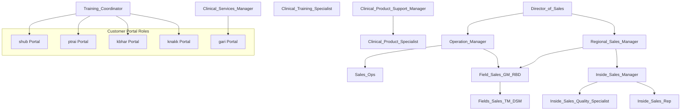
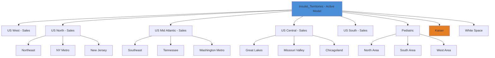
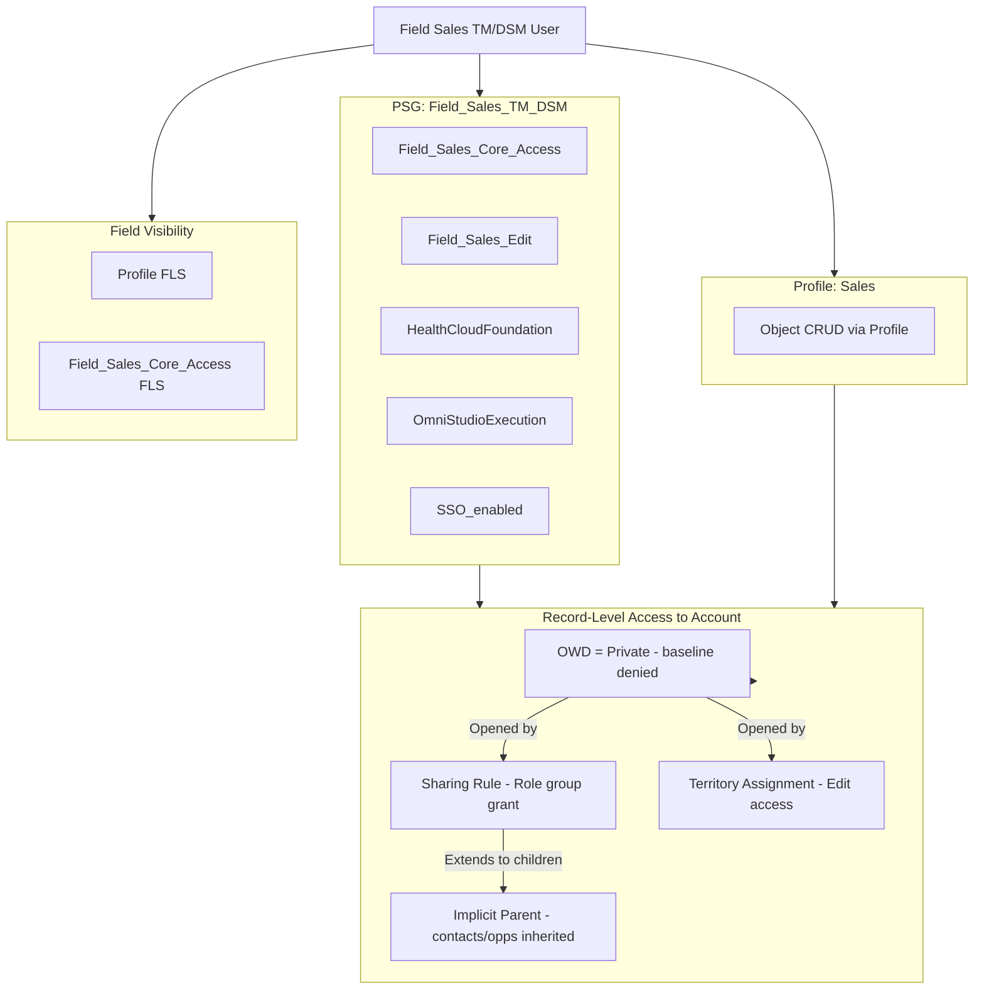
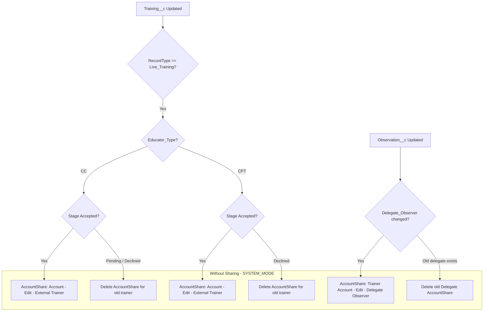
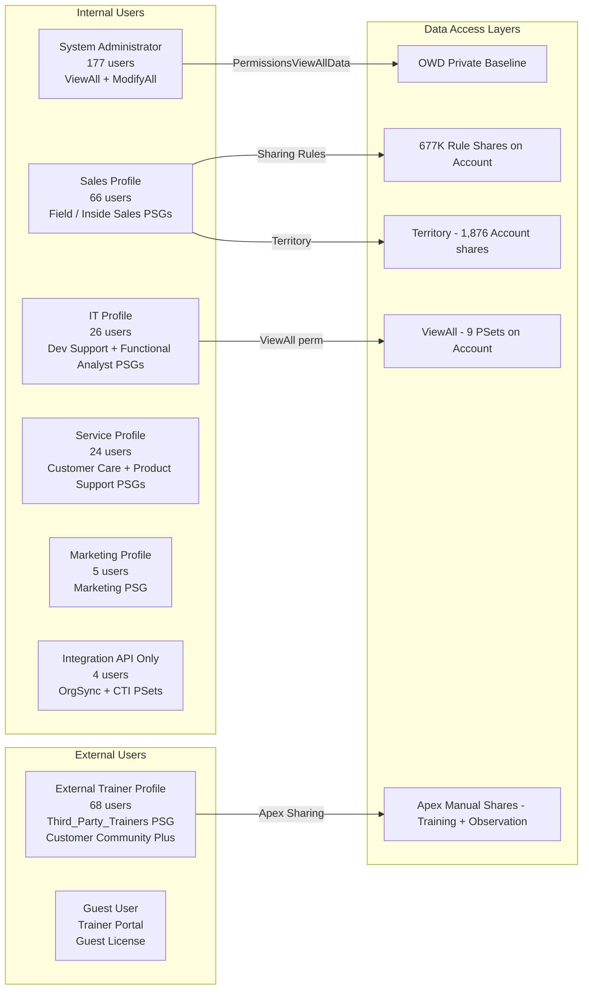

# Salesforce Sharing, Visibility & Access-Control Assessment
## Insulet Corporation — DevInt2 Sandbox (Unlimited Edition)

**Org ID:** `00Dbb000006gUxVEAU` | **Instance:** `omnipod--devint2.sandbox.my.salesforce.com`  
**Assessment Date:** March 9, 2026 | **API Version:** 66.0 | **Analyst:** AI Architect Assessment

> **Sandbox Caveat:** This assessment targets the **DevInt2** sandbox. Record-level data (share counts, user counts) may differ from Production. All metadata and structural findings are representative of the production configuration unless explicitly noted.

---

# DELIVERABLE 1 — EXECUTIVE SUMMARY

## Design Philosophy

Insulet's Salesforce org implements a **defense-in-depth, role-based sharing model** anchored by:

1. **Restrictive OWD** — Account, Contact, Opportunity, Lead, and Case are all set to **Private/ControlledByParent** internally and externally. This is the correct baseline for a medical device company handling sensitive patient data.
2. **Sharing Rules as the primary opening mechanism** — The AccountShare table contains **677,313 rule-based share records**, making sharing rules the dominant engine for extending access beyond OWD. Opportunity and Case sharing are far narrower (2,406 and 294 rule-based shares respectively).
3. **Territory Management 2.0** as the field-force access engine — One active territory model ("Insulet_Territories," activated December 2025) with 100 territories and 110 active user-territory associations drives Account/Contact/Lead access for the field sales workforce.
4. **Permission Set Groups as the persona-layering mechanism** — 27 custom PSGs encapsulate functional roles (Clinical Product Specialist, Field Sales TM/DSM, Inside Sales Rep, etc.) composed of modular permission sets. This is architecturally sound.
5. **Apex Managed Sharing** for two specialized workflows — Training acceptance (External Trainer → Account access) and Observation delegation (Delegate Observer → Trainer Account access) are managed via programmatic sharing.
6. **Experience Cloud (Trainer Portal)** — One live community for External Trainers (68 active `PowerCustomerSuccess` users), using the Community Plus license model.

## Key Drivers

- HIPAA/medical device compliance pressure demands Private OWD on patient data.
- The OrgSync integration (patient, consent, provider data synchronization with an external system) introduces multiple custom staging objects that are set to **Public Read/Write** OWD internally — a deliberate integration architecture choice but a data exposure risk.
- Territory Management is used for geographic sales alignment across both adult (Sales Geography) and pediatric (Sales Pediatric) sales forces, plus specialized Kaiser and Trainer territory types.
- The External Trainer community requires a controlled portal for third-party trainers who need time-limited access to specific patient accounts associated with scheduled training sessions.

## Top Risks & Priority Recommendations

| Priority | Risk | Evidence | Recommendation |
|----------|------|----------|----------------|
| **CRITICAL** | Odaseva backup service account holds **ViewAll + ModifyAll + ManageUsers + AuthorApex** — full system bypass | `Odaseva_Service_User_Permissions` perm set; `IsCustom=true`, `IsOwnedByProfile=false` | Rotate credentials quarterly; implement IP restriction; add Named Credential scope limits; review in Production |
| **CRITICAL** | 7 custom OrgSync staging objects (patient, consent, physician, ASPN) are set to **Internal OWD = Public Read/Write** | `OrgSync_Patient_Staging__c`, `OrgSync_Consent_Staging__c`, `OrgSync_Physician_Staging__c`, `OrgSync_ASPN_Staging__c`, `OrgSync_Consent_Staging__c`, `OrgSync_Mule_Errors__c` — all `InternalSharingModel: ReadWrite` | Restrict to Private OWD and grant access via permission set + sharing rules to integration users only |
| **HIGH** | `enableSecureGuestAccess = false` — Guest users are not restricted by enhanced sharing controls | `Sharing.settings-meta.xml` | Enable Secure Guest Access to prevent guest users from accessing public records not intentionally shared |
| **HIGH** | `Development_Support_Core_Access` and `Functional_Analyst_Core_Access` both grant **ViewAllData = true** to non-admin business roles | Live SOQL: both perm sets returned in ViewAllData=true query | Scope these to specific objects using per-object ViewAll rather than org-wide ViewAll |
| **HIGH** | `CTI_Integration_Access` grants **ViewAllData = true + API = true** — an integration perm set should not need org-wide visibility | Live SOQL result | Replace ViewAllData with specific object-level Read/ViewAll permissions scoped to CTI objects |
| **HIGH** | `Query_AllFiles` grants **ViewAllData = true** — intent is querying files but org-wide visibility is excessive | Live SOQL result | Replace with ContentDocument-specific permissions |
| **MEDIUM** | Manual Account shares (68) are user-to-account, outside Apex sharing management — no lifecycle governance | AccountShare RowCause=Manual: 68 records | Implement a scheduled cleanup job; document which shares are intentional |
| **MEDIUM** | `Clinic_Grouping__c` internal OWD = **Public Read/Write** — business object, not an integration staging object | EntityDefinition query | Assess if this is intentional; if not, restrict to Private |
| **MEDIUM** | `ASPN_Integration__e` Platform Event internal OWD = **Public Read/Write** + **External = Private** | EntityDefinition query | Review if all internal users need to subscribe to this event |
| **LOW** | `enableAdminLoginAsAnyUser = true` with no IP-based restriction | `Security.settings-meta.xml` | Log all login-as events; ensure MFA is enforced for admins |
| **LOW** | 18 installed packages, several (DocuSign, Marketing Cloud, Amazon Connect) have broad API access | Installed packages list | Review connected app OAuth scopes for each managed package |

---

# DELIVERABLE 2 — DETAILED NARRATIVE ASSESSMENT

## 2.1 Baseline Sharing Model

**Org-Wide Defaults — Internal:**

| Object | Internal OWD | External OWD | Notes |
|--------|-------------|-------------|-------|
| Account | **Private** | **Private** | Correct for patient/practice data. External model also Private. |
| Contact | **Private** | **Private** | Note: Contact is OWD=Private, not ControlledByParent, despite being a child. Multi-account contacts enabled. |
| Opportunity | **Private** | **Private** | Restricted — only NCS Opportunity record type in use |
| Lead | **Private** | **Private** | 3 record types: Patient, Provider-Practice Lead, 3rd Party Trainer |
| Case | **Private** | **Private** | 3 record types: Contact Us, Product Support, HCP Update Request |
| User | **Read** | **Private** | Users can see each other's records internally (standard Salesforce default) |
| Knowledge__kav | **ReadWrite** | **ReadWrite** | Knowledge articles are public read/write. This is appropriate for a knowledge base. |
| Observation__c | **ControlledByParent** | **ControlledByParent** | Inherits from parent Account |
| Training__c | **ControlledByParent** | **ControlledByParent** | Inherits from parent Account |
| PatientDataShare__c | **ControlledByParent** | **ControlledByParent** | Inherits from parent — appropriate for consent tracking |
| Reimbursement__c | **Private** | **Private** | Restricted — appropriate for financial data |
| OrgSync_Patient_Staging__c | **ReadWrite** | **Private** | **RISK** — all internal users can see patient staging data |
| OrgSync_Physician_Staging__c | **ReadWrite** | **Private** | **RISK** — physician staging data is wide open internally |
| OrgSync_ASPN_Staging__c | **ReadWrite** | **Private** | **RISK** — ASPN program staging data unrestricted |
| OrgSync_Consent_Staging__c | **ReadWrite** | **Private** | **RISK** — consent data staging unrestricted |
| OrgSync_Mule_Errors__c | **ReadWrite** | **Private** | Error records from MuleSoft visible to all |
| Clinic_Grouping__c | **ReadWrite** | **Private** | Potentially unintentional — business grouping object |

**Key Sharing Model Settings:**
- **External Sharing Model:** Enabled — separate internal/external OWD controls are active
- **Manager Groups:** Disabled — role hierarchy does NOT include manager groups for sharing
- **Account Role Optimization:** Enabled — portal role optimization active
- **Asset Sharing:** Enabled
- **Portal User Case Sharing:** Enabled — community users automatically get case sharing
- **Standard Report Visibility:** Enabled — users can see reports shared with them
- **Restrict Access Lookup Records:** Disabled — users can see lookup fields even without record access
- **Secure Guest Access:** **Disabled** — critical gap; guest users are not subject to enhanced security restrictions
- **Manual User Record Sharing:** Disabled

## 2.2 Territory Management 2.0

Territory Management 2.0 is **active and the primary mechanism for Account and Contact record distribution** to the field sales organization.

**Active Model:** `Insulet_Territories` (activated December 11, 2025)

| Object | Territory Access Level |
|--------|----------------------|
| Account | Edit |
| Contact | Edit |
| Lead | Read |
| Case | None (not territory-controlled) |
| Opportunity | None (opportunity filter disabled) |

**Territory Hierarchy (100 territories in active model):**

The territory structure is hierarchical with root territories representing national or specialty segments:
- **US West / North / Mid Atlantic / Central / South — Sales** (Sales Geography type) → sub-divided into regional territories
- **Pediatric** (Sales Pediatric type) → North Area, South Area, West Area
- **Kaiser** (Kaiser type) — specialized payer segment
- **White Space** — unassigned geographic coverage

Territory types in use: `Sales_Geography`, `Sales_Pediatric`, `Kaiser` (out of 6 defined types — `Trainer` and `All_Consumer_Accounts` types appear to be unused in the active model).

**Evidence:** AccountShare table shows `Territory` RowCause = 1,876 records; `Territory2AssociationManual` = 180 records (manual territory overrides). This confirms territory management is actively assigning account access.

**Opportunity Filter:** Disabled — territory management does not automatically assign opportunities to territory owners. This means opportunity access relies on OWD=Private + sharing rules/owner-based access only.

## 2.3 Mechanism Interactions: How Records Become Visible

```
Account Access Decision Tree (example: Practice Account record)
───────────────────────────────────────────────────────────────
1. Is user the owner?       → Owner access (AccountShare RowCause=Owner, 129,959 records)
2. Is user above owner      → Role hierarchy access (implicit upward visibility)
   in role hierarchy?
3. Is user in an active     → Territory access (RowCause=Territory, 1,876 records)
   territory that contains
   this account?
4. Does a sharing rule      → Rule access (RowCause=Rule, 677,313 records) — DOMINANT mechanism
   match?
5. Is user a portal user    → PortalImplicit (68 records) + RelatedPortalUser
   related to this account?
6. Has an Apex class        → Manual share (RowCause=Manual, 68 records)
   created a Manual share?  → Also: TrainingSharingHandler, ObservationSharingHandler
7. Does user have ViewAll   → 9 perm sets/profiles hold ViewAll on Account
   on Account?
8. Does user have           → Admin profile, Odaseva perm set
   PermissionsViewAllData?
```

## 2.4 Sharing Rules (Primary Access Mechanism)

The sheer volume of rule-based AccountShare records (677,313) reveals that **criteria-based or owner-based sharing rules are the dominant mechanism for extending Account access** beyond OWD=Private. The exact rule definitions cannot be retrieved without metadata retrieval (no local `sharingRules/` directory present), but the share record volume and recipient group analysis reveals the following pattern:

**AccountShare Rule Recipients (from sampled records):**
- `00Gbb000009aVmWEAU` — Clinical_Product_Specialist (Role group)
- `00Gbb000008YAaEEAW` — Inside_Sales_Manager (Role+Subordinates group)
- `00Gbb000008YAa4EAG` — Sales_Ops (Role group)
- `00Gbb000008OS1lEAG` — Training_Coordinator (Role group)
- `00Gbb000008dGhpEAE` — Clinical_Training_Specialist (Role group)
- `00Gbb000008YAaAEAW` — Fields_Sales_TM_DSM (Role+Subordinates group)

This confirms sharing rules share Account records with **role-based groups**, granting the entire role (and potentially subordinates) access to accounts they don't own. This is consistent with a territory/role-aligned sales model where field reps need to see accounts assigned to their peers or the broader team.

**Opportunity Sharing:** 2,406 rule-based shares (equal to owner count), suggesting owner-based sharing rules that mirror ownership — likely sharing each Opportunity with the owner's role group or a specific team group.

**Case Sharing:** 294 rule-based shares against 477 owner shares — targeted sharing, consistent with a service model where cases are shared with specific queues or groups rather than broadly with roles.

## 2.5 Apex Managed Sharing

Two dedicated Apex-managed sharing classes are in production use:

### ObservationSharingHandler
- **Trigger:** `ObservationTrigger` (on Observation__c update)
- **What it does:** When `Delegate_Observer__c` on an Observation changes, it creates/deletes AccountShare records (RowCause=Manual) sharing the **Trainer Account** with the **Delegate Observer user**
- **Access Level:** Edit
- **Security context:** `inherited sharing` outer class; `without sharing` inner class `ObservationSharingHandlerSystemContext` with `AccessLevel.SYSTEM_MODE` for DML — bypasses sharing rules to create the share record
- **Confidence:** High (direct code review)

### TrainingSharingHandler
- **Trigger:** `TrainingTrigger` (on Training__c update)
- **What it does:** When Training `Training_Stage__c` changes to "Accepted," it shares the **related Account** with the **External Trainer user** via AccountShare (RowCause=Manual/'')
- **Logic branches:** CC educator (pending/declined reversal handled) vs. CPT educator (declined-from-accepted reversal handled)
- **Access Level:** Edit
- **Security context:** `inherited sharing` outer class; `without sharing` inner class `TrainingSharingHandlerSystemContext` with `AccessLevel.SYSTEM_MODE`
- **Confidence:** High (direct code review)

### Additional Apex Sharing Patterns
The following 43 additional Apex classes reference sharing/AccessLevel patterns (indirect or ACR-based):
- `OrgSync_Patient_ACRService` — Manages AccountContactRelation creation using `SYSTEM_MODE`. Not direct sharing, but controls which accounts a patient contact is related to (affects implicit sharing).
- Multiple `OrgSync_*Service` classes — Use `WITH SYSTEM_MODE` in SOQL and `AccessLevel.SYSTEM_MODE` in DML for integration operations. These run in elevated privilege mode, bypassing the calling user's sharing context.
- `ScheduledPermissionAssigner` — Assigns permission sets on a scheduled basis. Security risk if misconfigured.
- `TerritoryAssignmentService` / `ObjectTerritory2AService` — Manages Territory2 assignments programmatically.

## 2.6 Experience Cloud (Trainer Portal)

- **Network:** "Trainer Portal" — Status: **Live** — URL: `/TrainerPortalvforcesite`
- **Active community users:** 68 External Trainers using `PowerCustomerSuccess` license (Customer Community Plus)
- **Community profiles:** 
  - `External Trainer` (PowerCustomerSuccess type) — active users: 68
  - `Trainer Portal Profile` (Guest UserType) — guest access
- **Guest User profile:** `Guest License User` also exists (default site guest)
- **Sharing configuration concerns:**
  - `enableSecureGuestAccess = false` — Guest users are not subject to enhanced guest access restrictions
  - `enableCommunityUserVisibility = false` — Community users cannot see each other
  - `enablePortalUserVisibility = false` — Portal users hidden from internal users' searches
  - `enableExternalAccHierPref = false` — External account hierarchy disabled
  - `enablePreventBadgeGuestAccess = true` — Badge access blocked for guests (positive control)
- **Apex sharing for community:** TrainingSharingHandler grants External Trainers (Edit access) to the patient's Account when a training session is accepted. This is the mechanism by which community users gain record visibility — not sharing sets.
- **Sharing Sets:** Not directly queried (SharingSet object was not accessible in this sandbox), but the architecture relies on Apex sharing rather than declarative Sharing Sets.

## 2.7 Implicit Sharing

- **Parent-to-child (Implicit Parent):** AccountShare records with `RowCause=ImplicitParent` = 1,905. This means Contacts, Opportunities, and Cases are visible to account record holders through implicit parent sharing.
- **PortalImplicit:** 68 AccountShare records — when a community user is associated with an Account as a Contact, they get implicit visibility to the Account. This matches the 68 active External Trainer community users.
- **RelatedPortalUser on Case:** 1 CaseShare record with `RowCause=RelatedPortalUser` — a community user who submitted a case can see it.
- **Account-Contact Relationship (multi-account):** `enableRelateContactToMultipleAccounts = true` — Contacts can be related to multiple accounts via AccountContactRelation. ACR creation is managed by `OrgSync_Patient_ACRService` for Patient→Practice relationships using the "Patient - Practice Affiliation" role.
- **Account Teams:** DISABLED — no team-based implicit sharing.
- **Opportunity Teams:** Not explicitly checked in settings (Opportunity settings did not list opportunity teams), assumed disabled based on OWD restrictions.

## 2.8 Persona Permission Architecture

**35 Profiles** — User license types in use:
- Salesforce (full): Admin, Sales, Service, IT, Marketing, End User, various specialty profiles
- Customer Community Plus: External Trainer
- API/Integration: Integration API Only, Minimum Access - API Only Integrations, Salesforce API Only System Integrations
- Other system: Analytics Cloud Integration User, Sales Insights Integration User, SalesforceIQ Integration User

**51 Permission Sets + 27 Permission Set Groups** implement a modular capability model. Key business PSGs and their composition:

| PSG | Core Access PSets |
|-----|------------------|
| Field_Sales_TM_DSM | Field_Sales_Core_Access, Field_Sales_Edit, HealthCloudFoundation, OmniStudioExecution |
| Field_Sales_GM_RBD | Field_Sales_Core_Access, HealthCloudFoundation |
| Inside_Sales_Rep | Inside_Sales_Core_Access, Manage_Reports_and_List_View, HealthCloudFoundation, OmniStudio |
| Inside_Sales_Manager | Inside_Sales_Manager_Access, Manage_Reports_and_List_View, HealthCloudFoundation |
| Clinical_Services_Manager | Field_Clinical, HealthCloudFoundation, OmniStudioExecution |
| Commercial_Sales | Commercial_Sales_Core_Access, Manage_Reports_and_List_View, HealthCloudFoundation |
| Development_Support | Development_Support_Core_Access, **IT_Modify_all**, SSO_enabled |
| Functional_Analyst | **Functional_Analyst_Core_Access** (ViewAllData=true), SSO_enabled |
| View_All | **View_All_Read_Only**, SSO_enabled |
| Third_Party_Trainers | External_Trainers, Composer_Salesforce_Community_User |

**Top PermSet Assignments (actual user assignments):**
- Third_Party_Trainers PSG: 26 users (External Trainers)
- Training_Coordinators PSG: 21 users
- DocuSign roles: 16-18 users each
- Clinical_Services_Manager PSG: 13 users
- OrgSync_User_Access: 11 users (integration accounts)

**Bypass permission set holders:**

| Permission Set | ViewAllData | ModifyAllData | Users |
|---------------|------------|--------------|-------|
| Odaseva_Service_User_Permissions | YES | **YES** | (Odaseva integration user) |
| CTI_Integration_Access | YES | No | Amazon Connect users |
| Query_AllFiles | YES | No | (file query role) |
| Development_Support_Core_Access | YES | No | ~7 IT/Dev users |
| Functional_Analyst_Core_Access | YES | No | ~7 analysts |
| sfdc_a360_sfcrm_data_extract | YES | No | Data Cloud connector |

## 2.9 Record Types and Profile Visibility

**Account Record Types** (6 active):
- Patient, Patient Delegate, Person Account, Provider, Trainer (all IsPersonType=true — Person Accounts)
- Practice, Pharmacy (standard business accounts)

The presence of Person Accounts for Patient, Patient Delegate, Provider, and Trainer is significant — Person Account records have a tighter implicit sharing model and the Contact is system-managed.

**Training__c Record Types** (3): CPT Training, E-Learning, Live Training — TrainingSharingHandler only applies sharing logic to `Live_Training` record type.

**Case Record Types** (3): Contact Us, Product Support, HCP Update Request

**Lead Record Types** (3): Patient, Provider-Practice Lead, 3rd Party Trainer

## 2.10 Connected Applications and Integration Security

18 installed packages provide various integration points. Of particular note:
- **AppOmni** (v1.72) — Security monitoring platform with its own data access
- **OmniStudio** (v260.6/Spring 2026) — Omnipresent in PSGs; all field/clinical roles receive OmniStudio execution permissions
- **Odaseva** — Backup/data management with the single most dangerous permission set in the org
- **OrgSync-Framework-CDC** (v2.8.0) — Patient/provider data sync using XCDC/CDC framework; staging objects are Public Read/Write

---

# DELIVERABLE 3 — VISUAL MODELS

## 3.1 Role Hierarchy



## 3.2 Territory Model Structure



## 3.3 Access Architecture — How a Field Sales User Sees an Account



## 3.4 Apex Managed Sharing Decision Flow



## 3.5 Persona Access Map (Summary)



---

# DELIVERABLE 4 — OBJECT VIEW BY PERSONA MATRIX

> Legend: C=Create, R=Read, U=Update, D=Delete, VA=ViewAll, MA=ModifyAll, P/S=via Profile or Sharing  
> Confidence: H=High (direct metadata), M=Medium (inferred from PSG composition)

## 4.1 Markdown Table

| Object | Sys Admin | Sales (Field TM/DSM) | Sales (Inside Rep) | IT/Dev Support | Service/Care | Marketing | External Trainer | Integration API | OWD Internal |
|--------|-----------|---------------------|-------------------|---------------|-------------|-----------|-----------------|----------------|-------------|
| Account | CRUDVAMA | CRUD (Rule+Terr) | CRUD (Rule) | CRUD+VA | CRUD (Rule) | R (Rule) | R (Apex Share) | CRUD+VA | Private |
| Contact | CRUDVAMA | CRUD (implicit/Rule) | CRUD (Rule) | CRUD+VA | CRUD (Rule) | R | R (if linked) | CRUD+VA | Private |
| Opportunity | CRUDVAMA | CRUD (Owner/Rule) | CRUD | CRUD+VA | R (Rule) | R | No | R+VA | Private |
| Lead | CRUDVAMA | CRUD (Owner/Queue) | CRUD (Queue) | CRUD+VA | CRUD | CRUD | No | CRUD | Private |
| Case | CRUDVAMA | R (Rule) | R (Rule) | CRUD+VA | CRUD (Owner) | No | R (RelPortal) | CRUD | Private |
| Training__c | CRUDVAMA | R | CRUD | CRUD+VA | CRUD (Owner) | No | CRUD (Owner) | CRUD | ControlledByParent |
| Observation__c | CRUDVAMA | R | R | VA | CRUD | No | CRUD (Account link) | CRUD | ControlledByParent |
| OrgSync_Patient_Staging__c | CRUDVAMA | CRUD* | CRUD* | CRUD | CRUD* | CRUD* | No | CRUD | **ReadWrite** |
| Reimbursement__c | CRUDVAMA | CRUD (Rule) | No | CRUD+VA | CRUD | No | No | CRUD | Private |
| PatientDataShare__c | CRUDVAMA | R (via Account) | R | VA | CRUD | No | No | CRUD | ControlledByParent |
| Knowledge__kav | CRUDVAMA | R | R | CRUD+VA | CRUD | R | R | CRUD | ReadWrite |
| Survey__c | CRUDVAMA | R | R | VA | CRUD | CRUD | No | CRUD | Private |

> *OrgSync staging objects: Any user with Read on the object can access ALL records due to OWD=ReadWrite (Public Read/Write). No sharing rules needed.

## 4.2 CSV Export

```csv
Object,SysAdmin,Field_TM_DSM,Inside_Rep,IT_DevSupport,Service_Care,Marketing,ExternalTrainer,Integration_API,OWD_Internal
Account,CRUDVAMA,CRUD_Rule+Terr,CRUD_Rule,CRUD+VA,CRUD_Rule,R_Rule,R_ApexShare,CRUD+VA,Private
Contact,CRUDVAMA,CRUD_implicit,CRUD_Rule,CRUD+VA,CRUD_Rule,R,R_linked,CRUD+VA,Private
Opportunity,CRUDVAMA,CRUD_Owner,CRUD,CRUD+VA,R_Rule,R,No,R+VA,Private
Lead,CRUDVAMA,CRUD_Queue,CRUD_Queue,CRUD+VA,CRUD,CRUD,No,CRUD,Private
Case,CRUDVAMA,R_Rule,R_Rule,CRUD+VA,CRUD_Owner,No,R_RelPortal,CRUD,Private
Training__c,CRUDVAMA,R,CRUD,CRUD+VA,CRUD_Owner,No,CRUD_Owner,CRUD,ControlledByParent
Observation__c,CRUDVAMA,R,R,VA,CRUD,No,CRUD_AcctLink,CRUD,ControlledByParent
OrgSync_Patient_Staging__c,CRUDVAMA,CRUD_OWD,CRUD_OWD,CRUD,CRUD_OWD,CRUD_OWD,No,CRUD,ReadWrite_RISK
Reimbursement__c,CRUDVAMA,CRUD_Rule,No,CRUD+VA,CRUD,No,No,CRUD,Private
PatientDataShare__c,CRUDVAMA,R_via_Account,R,VA,CRUD,No,No,CRUD,ControlledByParent
Knowledge__kav,CRUDVAMA,R,R,CRUD+VA,CRUD,R,R,CRUD,ReadWrite
Survey__c,CRUDVAMA,R,R,VA,CRUD,CRUD,No,CRUD,Private
```

---

# DELIVERABLE 5 — PERSONA VIEW BY OBJECT/RECORDS/FIELDS MATRIX

## 5.1 System Administrator

- **Profile:** Admin (Salesforce license)
- **Bypass Permissions:** ViewAllData=true, ModifyAllData=true, ManageUsers=true, AuthorApex=true
- **Record Access:** Unrestricted — all records visible and editable regardless of OWD or sharing
- **Field Access:** Unrestricted
- **Known Users (sample):** 177 active users in this profile (sandbox includes developers/admins)
- **Risk Note:** 177 Admin users is extremely high for a sandbox; production should be reviewed. Admin login-as is enabled.

## 5.2 Sales Profile — Field Sales TM/DSM (PSG: Field_Sales_TM_DSM)

- **Base Profile:** Sales
- **PSG:** Field_Sales_TM_DSM → [Field_Sales_Core_Access, Field_Sales_Edit, HealthCloudFoundation, OmniStudioExecution, Omnistudio_Standard_User, SSO_enabled]
- **Account Records:** Access via sharing rules (role-based groups) + territory assignment. OWD=Private means only accounts opened via these mechanisms are visible.
- **Contact Records:** Inherited via Account implicit sharing + sharing rules
- **Opportunity Records:** Own records + rule-based sharing. Territory management does NOT automatically share Opportunities.
- **Lead Records:** Via Queue assignment (DTC, Lead Generation Team queues + owner)
- **Training__c:** Read-only (Training records owned by the External Trainer/CTS, not the field rep)
- **Role in Hierarchy:** Fields_Sales_TM_DSM → Field_Sales_GM_RBD → Regional_Sales_Manager → Director_of_Sales (inherits upward visibility on owned records)
- **Field Access:** Field_Sales_Core_Access + Field_Sales_Edit PSets define FLS (not directly extracted — requires full FLS query)

## 5.3 Sales Profile — Inside Sales Rep (PSG: Inside_Sales_Rep)

- **PSG:** Inside_Sales_Rep → [Inside_Sales_Core_Access, Manage_Reports_and_List_View, HealthCloudFoundation, OmniStudioExecution, Omnistudio_Standard_User, SSO_enabled]
- **Account Records:** Via sharing rules (Inside_Sales_Manager Role group, Inside_Sales_Rep group)
- **Lead Records:** Queue-based (DTC queues, Inside Sales Specialist queue)
- **Opportunity Records:** Own + sharing rules
- **Reports/Dashboards:** Manage_Reports_and_List_View grants additional report management capabilities

## 5.4 IT Profile — Development Support (PSG: Development_Support)

- **PSG:** Development_Support → [Development_Support_Core_Access, IT_Modify_all, SSO_enabled]
- **Bypass:** Development_Support_Core_Access has **ViewAllData=true** — sees ALL records across the org
- **IT_Modify_all:** By name, implies broad modify access — exact permissions require FLS/ObjectPermissions inspection
- **Risk:** These are non-admin users with admin-equivalent visibility. Appropriate for a DevInt2 sandbox; must be reviewed in production.

## 5.5 IT Profile — Functional Analyst (PSG: Functional_Analyst)

- **PSG:** Functional_Analyst → [Functional_Analyst_Core_Access, SSO_enabled]
- **Bypass:** Functional_Analyst_Core_Access has **ViewAllData=true**
- **Risk:** Analysts can see all records including patient staging data. Confirm this is intentional and that production has commensurate audit logging.

## 5.6 Service Profile — Customer Care (PSG: Customer_Care_Agent)

- **PSG:** Customer_Care_Agent → [Customer_Care_Core_Access, HealthCloudFoundation, OmniStudioExecution, SSO_enabled]
- **Case Records:** Primary — own + rule-based
- **Account Records:** Rule-based (Sales Ops Queue, related account sharing)
- **Knowledge:** Read access (Knowledge OWD = ReadWrite globally)

## 5.7 External Trainer (Profile: External Trainer, PSG: Third_Party_Trainers)

- **License:** Customer Community Plus
- **PSG:** Third_Party_Trainers → [External_Trainers, Composer_Salesforce_Community_User]
- **Account Records:** Only accounts shared via `TrainingSharingHandler` (Edit access to patient/practice accounts when assigned Training is in Accepted state) + PortalImplicit (68 records)
- **Training__c:** Owns their assigned training records (CRUD on owned records)
- **Observation__c:** Via account link (ControlledByParent — if they have the parent account, they see observations)
- **Profile restriction:** `enableCommunityUserVisibility = false` — cannot see other community users
- **Community:** Trainer Portal (Live at /TrainerPortalvforcesite)
- **Note:** 26 users have Third_Party_Trainers PSG assigned (subset of 68 External Trainer profile users)

## 5.8 Integration API Only (OrgSync / CTI)

- **Profile:** Integration API Only
- **Key PermSets:** OrgSync_User_Access (11 users), CTI_Integration_Access (ViewAllData=true, API=true)
- **OrgSync staging objects:** CRUD access — these accounts are the write endpoint for OrgSync data synchronization
- **CTI (Amazon Connect):** ViewAllData=true enables reading all org data for routing/lookup purposes

## 5.9 Odaseva Backup User (Perm Set: Odaseva_Service_User_Permissions)

- **Permissions:** ViewAllData=true, **ModifyAllData=true**, ManageUsers=true, ApiEnabled=true, AuthorApex=true
- **Scope:** Full org access — can read and modify all data, manage users, and execute Apex
- **Risk Level:** CRITICAL — this is effectively a super-admin API service account
- **Object Access via ObjectPermissions:** ViewAll + ModifyAll on all audited custom objects

## 5.10 Persona Summary Matrix — CSV

```csv
Persona,Profile,PSG,ViewAllData,ModifyAllData,Account_Access,Contact_Access,Opp_Access,Case_Access,Training_Access,OrgSync_Staging_Access,PatientData_Access
System_Admin,Admin,None,Yes,Yes,All,All,All,All,All,All,All
Field_TM_DSM,Sales,Field_Sales_TM_DSM,No,No,Rule+Territory,Implicit,Owner+Rule,Rule_only,Read,ReadWrite_OWD,ControlledByParent
Inside_Sales_Rep,Sales,Inside_Sales_Rep,No,No,Rule,Rule+Implicit,Owner+Rule,Rule_only,Read,ReadWrite_OWD,ControlledByParent
Dev_Support,IT,Development_Support,Yes,No,All,All,All,All,All,All,All
Functional_Analyst,IT,Functional_Analyst,Yes,No,All,All,All,All,All,All,All
Customer_Care_Agent,Service,Customer_Care_Agent,No,No,Rule,Rule,No,Owner+Rule,Read,ReadWrite_OWD,ControlledByParent
Clinical_Services_Mgr,Sales,Clinical_Services_Manager,No,No,Rule+Group,Rule+Group,No,Rule,CRUD,ReadWrite_OWD,ControlledByParent
External_Trainer,External Trainer,Third_Party_Trainers,No,No,Apex_Share_only,PortalImplicit,No,RelPortal,Owner,No,Via_Account
Odaseva_Integration,Various,Odaseva_Service_User_Permissions,Yes,Yes,All,All,All,All,All,All,All
OrgSync_Integration,Integration API Only,OrgSync_User_Access,No,No,CRUD_via_Pset,CRUD_via_Pset,No,No,No,Full_CRUD,CRUD
```

---

# DELIVERABLE 6 — SHARING MECHANISM CATALOG

| # | Mechanism | Type | Objects Affected | Evidence Source | Volume/Scale | Confidence |
|---|-----------|------|-----------------|----------------|-------------|------------|
| 1 | **OWD Private (Internal)** | Baseline Restriction | Account, Contact, Opportunity, Lead, Case, Reimbursement__c, Survey__c | Organization SOQL + EntityDefinition Tooling API | Applies to all records | **High** |
| 2 | **OWD Private (External)** | Baseline Restriction | Same as above + additional objects | EntityDefinition Tooling API | Applies to all external users | **High** |
| 3 | **OWD ControlledByParent** | Inheritance Rule | Contact (via Account), Observation__c, Training__c, PatientDataShare__c, Activity, Address, AccountContactRelation, OrgSync_Training_Staging__c, OrgSync_Training_Profile_Staging__c, ZipCode__c, Certification__c, Reimbursement_Association__c | EntityDefinition Tooling API | All records of these types | **High** |
| 4 | **OWD ReadWrite / Public** | Baseline Open | OrgSync_Patient_Staging__c, OrgSync_Physician_Staging__c, OrgSync_ASPN_Staging__c, OrgSync_Consent_Staging__c, OrgSync_Mule_Errors__c, Clinic_Grouping__c, Knowledge__kav, ASPN_Integration__e | EntityDefinition Tooling API | All records of these types | **High** |
| 5 | **Role Hierarchy** | Implicit Upward | All Private + ControlledByParent objects | UserRole SOQL (26 roles) | 26 roles, ~200 internal users | **High** |
| 6 | **Territory Management 2.0 (Insulet_Territories model)** | Territory-Based | Account=Edit, Contact=Edit, Lead=Read | Territory2Model + Territory2 SOQL; AccountShare RowCause=Territory (1,876) | 100 territories, 110 user assignments | **High** |
| 7 | **Territory2AssociationManual** | Territory Override | Account | AccountShare RowCause=Territory2AssociationManual (180) | 180 manual overrides | **High** |
| 8 | **Sharing Rules (Criteria/Owner-Based)** | Declarative Rules | Account (677,313), Opportunity (2,406), Case (294) | AccountShare/OpportunityShare/CaseShare RowCause=Rule | 680,013 total | **High** |
| 9 | **Apex Managed Sharing — TrainingSharingHandler** | Programmatic | Account | Direct code review (TrainingSharingHandler.cls) | Per Training accepted event | **High** |
| 10 | **Apex Managed Sharing — ObservationSharingHandler** | Programmatic | Account | Direct code review (ObservationSharingHandler.cls) | Per Observation delegate change | **High** |
| 11 | **Manual Sharing (AccountShare)** | Manual | Account | AccountShare RowCause=Manual (68) | 68 records | **High** |
| 12 | **Implicit Parent Sharing** | Implicit | Contact, Opportunity, Case (via Account parent) | AccountShare RowCause=ImplicitParent (1,905) | 1,905 records | **High** |
| 13 | **Portal Implicit Sharing** | Community | Account | AccountShare RowCause=PortalImplicit (68); CommunitySettings | 68 records | **High** |
| 14 | **RelatedPortalUser Sharing** | Community | Case | CaseShare RowCause=RelatedPortalUser (1) | 1 record | **High** |
| 15 | **PermissionsViewAllData** | Object Bypass | All objects (org-wide) | PermissionSet SOQL (9 matching) | 9 perm sets/profiles | **High** |
| 16 | **PermissionsModifyAllData** | Object Bypass | All objects | PermissionSet SOQL | 2 non-profile (Odaseva + Admin profile) | **High** |
| 17 | **Per-Object ViewAllRecords** | Object-Level Bypass | Account (15 PSets), Campaign (17), Reimbursement__c (11), OrgSync staging (8-10 each) | ObjectPermissions SOQL (2,000 records) | 2,000 permission grants | **High** |
| 18 | **AccountContactRelation (Multi-Account)** | Relationship | Contact-to-multiple-Accounts | AccountSettings; OrgSync_Patient_ACRService.cls | Per ACR record | **High** |
| 19 | **Public Groups (11 named groups)** | Group Membership | Used as sharing rule targets | Group SOQL | 11 groups | **High** |
| 20 | **Queue-Based Access** | Queue Ownership | Lead (8 queues), Task (10 queues), Case (1 queue), Reimbursement__c (1 queue) | QueueSobject SOQL (19 records) | 16 queues, 19 queue-object mappings | **High** |
| 21 | **Experience Cloud (Trainer Portal)** | Community | Account, Training__c, Observation__c | Network SOQL, profile query, sharing analysis | 1 network, 68 users | **High** |
| 22 | **SAML SSO** | Authentication | All (identity) | Security.settings-meta.xml | All users | **High** |
| 23 | **Admin Login As Any User** | Bypass | All | Security.settings-meta.xml | Admins only | **High** |
| 24 | **Without Sharing Apex classes** | Code-Level Bypass | Account (TrainingSharingHandler, ObservationSharingHandler), Integration (OrgSync classes) | Code review (45 classes) | Multiple service classes | **High** |
| 25 | **Territory2Forecast Share** | Territory | Opportunity | OpportunityShare RowCause=Territory2Forecast (1) | 1 record | **High** |
| 26 | **ScheduledPermissionAssigner** | Dynamic Access | User permissions | Code review (ScheduledPermissionAssigner.cls) | Scheduled apex | **Medium** |
| 27 | **AppOmni Security Package** | Monitoring/Bypass | All (read) | Installed packages | 1 package | **Medium** |

---

# DELIVERABLE 7 — FINDINGS AND RECOMMENDATIONS

## CRITICAL Findings

### F-001: Odaseva Backup Service Account Has Full System Admin Equivalent Permissions
- **Finding:** The `Odaseva_Service_User_Permissions` custom permission set grants `ViewAllData=true`, `ModifyAllData=true`, `ManageUsers=true`, `PermissionsApiEnabled=true`, and `PermissionsAuthorApex=true`. This is the most dangerous permission set in the org — it is functionally equivalent to the System Administrator profile with full API access.
- **Evidence:** Live SOQL: `SELECT Name, PermissionsViewAllData, PermissionsModifyAllData FROM PermissionSet WHERE PermissionsModifyAllData = true` returned `Odaseva_Service_User_Permissions` as a custom perm set (not profile-owned).
- **Risk:** If the Odaseva service account credentials are compromised, an attacker has full read/write access to all Salesforce data including patient records, can manage users, and can execute Apex code.
- **Recommendation:**
  1. Confirm which user(s) have this perm set assigned in Production.
  2. Implement IP range restriction on the Odaseva integration user to only Odaseva's documented IP ranges.
  3. Enable Named Credential with certificate-based auth rather than password-based.
  4. Review whether `ManageUsers` and `AuthorApex` are truly required for a backup service.
  5. Add login history monitoring and alert on any interactive logins.
  6. Consider if `ModifyAllData` can be scoped to specific objects instead.

### F-002: Seven OrgSync Staging Objects with Public Read/Write OWD Expose Sensitive Patient/Provider Data
- **Finding:** `OrgSync_Patient_Staging__c`, `OrgSync_Physician_Staging__c`, `OrgSync_ASPN_Staging__c`, `OrgSync_Consent_Staging__c`, `OrgSync_Mule_Errors__c`, `OrgSync_Consent_Staging__c` all have `InternalSharingModel = ReadWrite` — meaning any internal Salesforce user with object-level Read permission can access ALL records of these types without any sharing rules needed.
- **Evidence:** EntityDefinition Tooling API query, confirmed for each object.
- **Risk:** This effectively makes patient staging data (names, external IDs, practice associations, consent flags, ASPN program data) visible to all 200+ active internal users including Marketing, Sales, and Service. This is a HIPAA exposure risk.
- **Recommendation:**
  1. Change OWD for all OrgSync staging objects to **Private**.
  2. Grant explicit Read access via sharing rule or permission set to only the OrgSync integration user and the Administrators who need to troubleshoot.
  3. Evaluate whether any UI-facing users need access to staging records or if the data should be consumed via the transitioned canonical objects (Account, Contact, etc.) only.

---

## HIGH Findings

### F-003: Secure Guest Access Disabled — Trainer Portal Guest User Not Restricted
- **Finding:** `enableSecureGuestAccess = false` in `Sharing.settings-meta.xml`. This means the Guest User on the Trainer Portal site is NOT subject to enhanced guest user security restrictions introduced by Salesforce to prevent guest users from accessing records not explicitly shared with them.
- **Evidence:** `force-app/main/default/settings/Sharing.settings-meta.xml` line 16.
- **Risk:** Guest users may be able to query and access records that are publicly accessible beyond what is intentional, depending on sharing rules and page access configurations.
- **Recommendation:** Enable Secure Guest Access (`enableSecureGuestAccess = true`). Test the Trainer Portal for functionality after enabling.

### F-004: Development Support and Functional Analyst Permission Sets Grant Org-Wide ViewAllData
- **Finding:** `Development_Support_Core_Access`, `Development_Support` (PSG), `Functional_Analyst_Core_Access`, and `Functional_Analyst` (PSG) all have `PermissionsViewAllData = true`. These are assigned to ~7 IT/Dev users and ~7 Analyst users respectively (from Sales and IT profiles) — not just admins.
- **Evidence:** Live SOQL query returning all PermissionSets with ViewAllData=true.
- **Risk:** Business users in IT and Service profiles with these perm sets can see all patient data, financial data, and integration staging data — well beyond their functional need.
- **Recommendation:**
  1. Replace `PermissionsViewAllData = true` with per-object `PermissionsViewAllRecords = true` grants for only the specific objects these users need to troubleshoot.
  2. Apply the principle of least privilege — Functional Analysts likely don't need to see all Cases and all Patient staging data.
  3. In production, ensure these perm sets are not widely distributed.

### F-005: CTI Integration Access and Query_AllFiles Grant ViewAllData to Integration Roles
- **Finding:** `CTI_Integration_Access` (for Amazon Connect CTI) has `ViewAllData=true` and `PermissionsApiEnabled=true`. `Query_AllFiles` has `ViewAllData=true`.
- **Evidence:** Live SOQL.
- **Risk:** Integration accounts that only need to look up specific records for call routing should not have org-wide visibility.
- **Recommendation:**
  1. Replace `CTI_Integration_Access.PermissionsViewAllData` with object-specific grants: Read on Account, Contact, Case (the objects CTI needs for screen pop and routing).
  2. Rename `Query_AllFiles` to clarify its purpose and replace ViewAllData with ContentDocument/ContentVersion specific permissions.

### F-006: 177 System Administrator Users in Sandbox — Production Admin Count Needs Review
- **Finding:** The active user census shows 177 users on the System Administrator profile in DevInt2.
- **Evidence:** User census SOQL (limited to 200 rows).
- **Risk:** If production has a comparable number, this is a significant over-provisioning of the highest-privilege role.
- **Recommendation:** Audit production admin user count. Target <5-10 active System Administrators with MFA enforced. Use `View Setup and Configuration` permission for users who need setup read access without full admin.

---

## MEDIUM Findings

### F-007: Clinic_Grouping__c Has Public Read/Write OWD — Likely Unintentional
- **Finding:** `Clinic_Grouping__c` has `InternalSharingModel = ReadWrite` — all internal users can see and edit all Clinic Grouping records.
- **Evidence:** EntityDefinition query.
- **Risk:** Depending on data sensitivity, this could expose clinic grouping business logic or configurations that should be restricted.
- **Recommendation:** Evaluate if this was intentionally set to Public Read/Write. If not, change to Private with appropriate sharing rules.

### F-008: Manual Account Shares (68) Lack Lifecycle Management
- **Finding:** 68 Account records have been manually shared (RowCause=Manual). These are not governed by any automated cleanup process.
- **Evidence:** AccountShare RowCause=Manual aggregate count.
- **Risk:** Manual shares created for temporary purposes (e.g., for a specific user to cover for a colleague) accumulate over time and can leave access open long after the need expires.
- **Recommendation:** Implement a scheduled Apex job or Flow to review and clean up manual shares older than N days. Consider disabling manual sharing on specific object types if it is not a supported business process.

### F-009: 45 Apex Classes Use Sharing Keywords or AccessLevel — Unreviewed for Security Gaps
- **Finding:** 45 Apex classes reference `__Share`, `RowCause`, `SharingReason`, or `AccessLevel`. Of these, key classes use `without sharing` contexts and `AccessLevel.SYSTEM_MODE`, which bypasses all sharing rules.
- **Evidence:** Code grep results.
- **Risk:** If any of these classes have business logic flaws, they could create unintended shares or expose records.
- **Recommendation:** Conduct a security code review of all 45 classes, specifically examining: (1) whether `without sharing` / `SYSTEM_MODE` contexts are narrowly scoped; (2) whether share records created have appropriate RowCause reasons (not all use custom RowCause, some use blank string `''`); (3) whether share records are cleaned up when no longer needed.

### F-010: ScheduledPermissionAssigner Can Dynamically Modify User Access
- **Finding:** A class named `ScheduledPermissionAssigner` exists in the codebase and references `AccessLevel`.
- **Evidence:** Code grep; class present in `force-app/main/default/classes/ScheduledPermissionAssigner.cls`.
- **Risk:** Automated permission assignment can bypass normal governance if the assignment logic is flawed or if the scheduled job is triggered by data an attacker can control.
- **Recommendation:** Review the business logic and triggering conditions for ScheduledPermissionAssigner. Ensure it only assigns pre-approved permission sets and that its schedule and input data sources are locked down.

### F-011: Territory2 Opportunity Access is None — Opportunity Visibility Gap for Field Sales
- **Finding:** Territory2Settings shows `defaultOpportunityAccessLevel = None`. Opportunity filter is disabled. This means Territory Management does NOT grant field sales users access to Opportunities in their territory — they must rely solely on OWD=Private + sharing rules.
- **Evidence:** Territory2.settings-meta.xml.
- **Risk:** Field sales reps who are assigned to territories but don't own the opportunity record may not be able to see it unless an explicit sharing rule covers the case.
- **Recommendation:** Evaluate whether Territory Opportunity Access should be set to Read or Edit, or whether existing sharing rules are sufficient to cover the use case.

---

## LOW Findings

### F-012: Admin Login As Any User Enabled Without IP Restriction
- **Finding:** `enableAdminLoginAsAnyUser = true` in Security settings.
- **Evidence:** `force-app/main/default/settings/Security.settings-meta.xml`.
- **Risk:** Any admin can log in as any user without the user knowing. Combined with 177 admin users, this is a significant privilege.
- **Recommendation:** Log all Login-As events (SetupAuditTrail already captures them); consider restricting this capability to a named subset of admins via permission.

### F-013: 18 Installed Packages May Hold Broad Connected App OAuth Scopes
- **Finding:** 18 managed packages are installed, including DocuSign, Marketing Cloud, Amazon Connect, Odaseva, OmniStudio, and AppOmni.
- **Evidence:** installed-packages.json.
- **Risk:** Each package may have Connected Apps with broad OAuth scopes (`full` or `api`) that can be exploited if package credentials are compromised.
- **Recommendation:** Review OAuth scope for each connected app in Setup → Connected Apps. Restrict to minimum required scopes (e.g., `api` instead of `full`, or custom scope sets).

### F-014: Non-Deployed SharingRules Metadata — No Declarative Sharing Rule Documentation
- **Finding:** The local metadata snapshot does not include a `sharingRules/` directory. The 680,000+ rule-based share records are generated by sharing rules that have not been captured in source control.
- **Evidence:** Directory exploration — no `force-app/main/default/sharingRules/` exists.
- **Risk:** Without sharing rules in version control, accidental deletion or unreviewed modifications cannot be detected via code review.
- **Recommendation:** Add `SharingRules` to the project manifests and retrieve them into the snapshot. Run `sf project retrieve start --metadata SharingRules` for all objects with sharing rules.

### F-015: Guest License Users — Two Guest Profiles with Potential Overlap
- **Finding:** Two Guest-type profiles exist: "Trainer Portal Profile" (used for the community) and "Guest License User" (default site guest). Secure Guest Access is disabled for both.
- **Evidence:** Profile SOQL returning UserType=Guest profiles.
- **Risk:** The default Guest License User profile may inadvertently provide access if any Visualforce pages or sites are configured to use it.
- **Recommendation:** Review pages assigned to Guest License User profile; restrict to minimal object access; ensure Secure Guest Access is enabled.

---

*End of Assessment — Insulet Corporation DevInt2 Sandbox | March 9, 2026*
